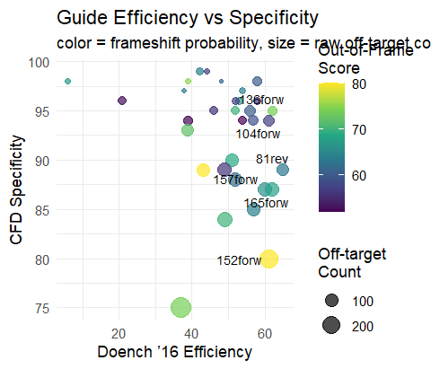
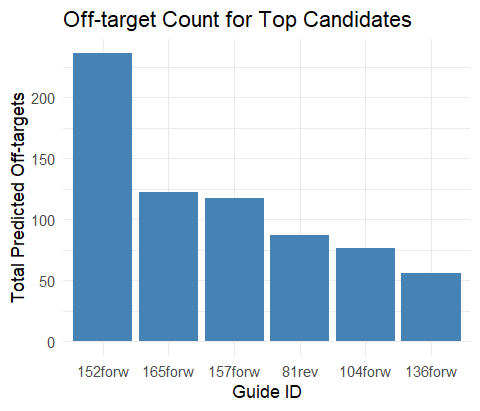
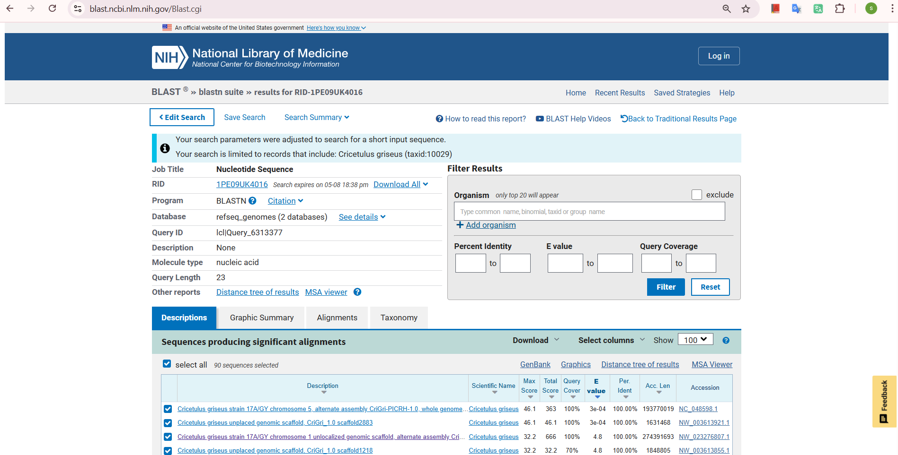

# Design History File (DHF) — Dual‑locus GS Knockout in CHO‑K1
*Author: Seyedsajjad Haghi*   *Start date: 2025‑04‑24*   

---

## 1 Project overview
- Goal: create a safer, more productive CHO platform by knocking out all GS activity with a single Cas9 sgRNA.
- Assemblies used: **NC_048598.1** (chr 5) and **NW_003613921.1** (scaffold 2883).

---

## 2 Guide design (Step 2 of pipeline)

### 2.1 Inputs

| Item | Link / Path |
|------|-------------|
| Exon-1 FASTA | [`data/exon1_glul_chr5.fasta`](../data/exon1_glul_chr5.fasta) |
| CRISPOR design (web) | <https://crispor.gi.ucsc.edu/crispor.py?batchId=aMGdfbP8brJISzWAaMfe> |
| CRISPOR off-target primers (web) | <https://crispor.gi.ucsc.edu/crispor.py?batchId=aMGdfbP8brJISzWAaMfe&pamId=s135%2B&otPrimers=1> |
| CRISPOR raw output | [`data/crispor_guides_raw.xls`](../data/crispor_guides_raw.xls),  [`data/crispor_guides_allscores.xls`](../data/crispor_guides_allscores.xls),  [`data/crispor_offtargets.xls`](../data/crispor_offtargets.xls) |
| Off-target primers PDF | [`docs/refs/crispor_offtarget_primers_136forw.pdf`](../refs/crispor_offtarget_primers_136forw.pdf) |

### 2.2 Process

- Used [CRISPOR](https://crispor.tefor.net/) to design sgRNAs targeting **exon 1** of **GLUL** (Gene ID: [100764163](https://www.ncbi.nlm.nih.gov/gene/100764163)) in CHO-K1.  
- Genome selected: **CriGri-PICRH (taxid 10029)**  
- Nuclease: SpCas9, PAM: NGG  
- Exported raw guide list, full scoring metrics, and off-targets as `.xls` files.  

### 2.3 Outputs

- [`crispor_guides_raw.xls`](../data/crispor_guides_raw.xls) – 32 candidate guides  
- [`crispor_guides_allscores.xls`](../data/crispor_guides_allscores.xls) – full metric table  
- [`crispor_offtargets.xls`](../data/crispor_offtargets.xls) – off-target predictions  

### 2.4 Selection

- Script: `scripts/select_guides.R`  
- Filtering criteria:  
  - **Doench ’16 efficiency ≥ 60**  
  - **CFD specificity ≥ 70**  
  - **Frameshift probability ≥ 50**  
- **Top guide:**  
  - **ID:** `136forw`  
  - **Sequence:** `TTTACAGTATGACCGAACAAT`  
  - **Note:** PAM sequence `GG` excluded from sgRNA design (present in genome only)
  

### 2.5 Visuals

  
*Figure 1: Efficiency vs. specificity (size = off-target count; color = frameshift likelihood).*

  
*Figure 2: Predicted off-target counts for top candidates.*

> See [R code for guide filtering](../scripts/select_guides.R).  

---

## 3 Dual-locus verification (Step 3)

### 3.1 Objective

Ensure the selected guide (`136forw`) targets **both genomic copies** of the GS gene in CHO-K1, including any unannotated duplicates.

### 3.2 Inputs

| File | Path |
|------|------|
| Guide with PAM | `TTTACAGTATGACCGAACAATGG` |
| BLAST output | `data/blast_136forw_alignment.txt` |
| Summary table | `data/blast_hits_summary.csv` |

### 3.3 Procedure

- Tool: [NCBI BLASTN](https://blast.ncbi.nlm.nih.gov/Blast.cgi)
- Query: 23 bp guide + NGG PAM (`TTTACAGTATGACCGAACAATGG`)
- Database: **RefSeq genomic assemblies**
- Organism: *Cricetulus griseus* (**taxid: 10029**, CriGri-PICRH)
- Settings:
  - Expect threshold = 10  
  - Word size = 11  
  - Match/Mismatch = 2/–3  
  - Gap costs = linear  
  - Filter low complexity: **ON**  
  - Max target sequences = 100

### 3.4 Key hits (100% identity)

| Accession | Location | Match | Description |
|-----------|----------|--------|-------------|
| `NC_048598.1` | 37,805,771–793 | 23/23 | Exon 1 of annotated GLUL (chr 5) |
| `NW_003613921.1` | 1,427,645–667 | 23/23 | Unannotated GLUL-like locus (scaffold 2883) |

> Full alignment text and summary table are included in the `/data` folder.

### 3.5 Visual proof

  
*Figure 3: BLAST results for guide 136forw showing perfect matches on both annotated and unplaced scaffold loci.*
> Summary available: [blast_hits_summary.csv](../data/blast_hits_summary..csv)

### 3.6 Decision

No need to design a second guide. The chosen guide `136forw` hits both known GS loci → ensures full knockout with a single sgRNA.

## 4 Indel spectrum prediction (Step 4)

### 4.1 Context‑sequence retrieval

| Item | Value / Path |
|------|--------------|
| Guide (23 nt + PAM) | **TTTACAGTATGACCGAACAATGG** |
| GLUL exon‑1 position | `NC_048598.1:37 805 744‑37 805 823` |
| Retrieval tool | UCSC **Get DNA in Window**[^ucsc] |
| Saved TXT (60 bp) | [data/seq60_136forw.txt](../data/seq60_136forw.txt) |

[^ucsc]: *UCSC Genome Browser → blue bar “Get DNA” → add 30 bp up‑ & downstream, tick **Reverse complement**, output upper‑case.*  
FASTA header kept as generated by UCSC for traceability.

### 4.2 inDelphi run

| Parameter | Setting |
|-----------|---------|
| Mode | **Single** |
| Cell line | **HEK293** (closest to CHO) |
| Left 30 nt + first 17 nt of guide | `TCCTGGGCCTTTACAGTATGACCGAA` |
| Last 3 nt of guide (CAA) + PAM (TGG) + 27 nt right flank | `CAATGGAGAGCCAGTGTCCCGGAGTGGCCA` |
| Strand arrow | ▶ points *right* (matches reverse‑complement input) |
| Share‑URL | <https://indelphi.giffordlab.mit.edu/single_HEK293_iXIKOwfYlarhhXA11cXHypoc_GGCCAGAG_47> |

### 4.3 Key results

| Metric | Value |
|--------|-------|
| **Frameshift probability** | **73.6 %** |
| Top indel | −3 bp micro‑homology deletion (14.9 %) |
| Precision score | 0.36 (typical) |

### 4.4 Interpretation

* A predicted frameshift rate > 70 % means a **single‑guide strategy is sufficient** for full GS knockout.  
* Predominant −3 bp deletion will be detectable by genotyping PCR.  
* Repair precision lies within normal Cas9 ranges; no need for alternative nucleases or dual‑guide designs at this stage.

---

## 5 KO Vector Cloning 

### 5.1 KO Vector Backbone

- Base plasmid: [`pX330-U6-Chimeric_BB-CBh-hSpCas9`](https://www.addgene.org/42230/) (Addgene #42230, Zhang lab)  
- Function: all-in-one Cas9 + sgRNA expression system  
- sgRNA under U6 promoter (Pol III); Cas9 under CBh promoter (Pol II)  
- NLS-tagged hSpCas9 with 3xFLAG tag; AmpR for selection in *E. coli*

### 5.2 KO Vector Cloning Summary

| Component   | Detail                                  |
|-------------|------------------------------------------|
| Guide       | `136forw`                                |
| Sequence    | `TTTACAGTATGACCGAACAAT` (21 bp)          |
| Insertion site | Between U6 promoter (6–254) and gRNA scaffold (276–351) |
| Plasmid feature | `sgRNA(136forw)` (255..275)         |

- The guide sequence was inserted precisely between the U6 promoter and the gRNA scaffold without altering flanking sequences.
- The resulting transcript:  
  `5'-TTTACAGTATGACCGAACAAT + scaffold-3'`

### 5.3 KO Vector Assembly and Verification

- Constructed in SnapGene as `pCas9-GS136_v1.dna`  
- Plasmid map exported as PNG: [`ko_vector.png`](../figures/ko_vector.png)  

> No unintended changes were introduced. The Cas9 ORF, CBh promoter, AmpR, and polyA signal remain intact. Vector is ready for downstream transfection.

  
---

---

## 6 Payload Vector Construction

### 6.1 Backbone and Source

- **Backbone:** [`PB-TAC-ERN_backbone.dna`](../vectors/payload/PB-TAC-ERN_backbone.dna) ([Addgene #80475](https://www.addgene.org/80475/)), containing PiggyBac inverted terminal repeats and mammalian expression elements.
- **GenBank reference:** [`PB-TAC-ERN_backbone.gbk`](../vectors/payload/PB-TAC-ERN_backbone.gbk) — fully annotated backbone for traceability.

### 6.2 Payload Cassette Design

| Component         | File Path/Name                                                  | Notes                                        |
|-------------------|----------------------------------------------------------------|----------------------------------------------|
| GS coding seq.    | [`data/GS_CDS_Cg_orf1.fa`](../data/GS_CDS_Cg_orf1.fa)          | Extracted via NCBI ORFfinder                 |
| Heavy chain Fab   | [`data/Fab_5D5A5_HC_CHOopt.fasta`](../data/Fab_5D5A5_HC_CHOopt.fasta)   | Backtranslated, codon-optimized for CHO      |
| Light chain Fab   | [`data/Fab_5D5A5_LC_CHOopt.fasta`](../data/Fab_5D5A5_LC_CHOopt.fasta)   | Backtranslated, codon-optimized for CHO      |
| Kozak sequence    | [`vectors/payload/Kozak_sequence.dna`](../vectors/payload/Kozak_sequence.dna)   | Added for translation efficiency             |
| Signal peptides   | [`vectors/payload/Signal_peptide_mouse_IgG_heavy.dna`](../vectors/payload/Signal_peptide_mouse_IgG_heavy.dna) | Mouse IgG for Fab HC secretion               |

### 6.3 Assembly Process

- Each cassette (GS, HC, LC) was built as:  
  `EF-1α promoter + gene CDS + EF-1α polyA`
  - Files: `GS_cassette.dna`, `HC_cassette.dna`, `LC_cassette.dna` (if missing, see `three_cassette_payload.dna`).
- Cassettes were inserted 5'→3' after excising Gateway/ccdB/mCherry (SrfI–SnaBI).
- Final assembled vector: [`PB-TAC-ERN_PAYLOAD_GS_HC_LC.dna`](../vectors/payload/PB-TAC-ERN_PAYLOAD_GS_HC_LC.dna)

### 6.4 Validation

- **Plasmid map:** [`figures/payload-vector.PNG`](../figures/payload-vector.PNG) — Schematic shows terminal repeats, cassettes, regulatory elements.
- **Restriction analysis:** All internal SrfI/SnaBI removed, cassette order confirmed.
- **GenBank export:** Annotated file `.gbk` or `.gb` available for submission or sharing.

---

## 7 Metabolic Simulation and GEM Modeling

### 7.1 Model & Files

- **Model:** [`models/iCHO2291.xml`](../models/iCHO2291.xml) (BioModels ID: MODEL1912180001)
- **CHO gene–reaction mapping:** [`data/CHO_model_genes.xlsx`](../data/CHO_model_genes.xlsx)

### 7.2 Simulation Workflow

- **Notebook:** [`notebooks/CHO_GS_Knockout_Metabolic_Modeling.ipynb`](../notebooks/CHO_GS_Knockout_Metabolic_Modeling.ipynb) ([Colab link](https://colab.research.google.com/drive/1wxEwLF_tmXh9yK7Jov-OPQbkZpKW6nTp))
- Steps:
    - Model loaded, double GS KO simulated (100764163, 100689337)
    - Glutamine uptake varied (EX_gln_L(e))
    - Biomass flux recorded for WT, KO, rescue scenarios
    - Output plots generated

### 7.3 Output & Visuals

- **Barplot:** [`figures/sim_growth_biomass.png`](../figures/sim_growth_biomass.png)
- **Raw output:** Any key CSVs from simulation in `data/`

---

## 8 Repository Structure & Data Availability

- **Repo:** [https://github.com/seyedsajjad98/gs-ko-cho-in-silico](https://github.com/seyedsajjad98/gs-ko-cho-in-silico)
- **Zenodo DOI:** (add here if available)

| Folder                  | Description                                      |
|-------------------------|--------------------------------------------------|
| `/data/`                | All sequence data, CRISPOR, inDelphi, BLAST      |
| `/figures/`             | Thesis and report figures (PNG/PDF)              |
| `/models/`              | GEM files (iCHO2291.xml)                         |
| `/notebooks/`           | Metabolic modeling notebook                       |
| `/vectors/ko/`          | KO vector SnapGene, GenBank files                |
| `/vectors/payload/`     | Payload vector, cassettes, sequence files        |
| `/scripts/`             | Scripts for guide selection, data parsing        |

---

## 9 References

- Addgene #80475 (PB-TAC-ERN backbone): <https://www.addgene.org/80475/>
- SnapGene: <https://www.snapgene.com/>
- EMBOSS Backtranseq: <https://www.ebi.ac.uk/Tools/st/emboss_backtranseq/>
- IDT Codon Optimization Tool: <https://eu.idtdna.com/pages/tools/codon-optimization-tool>
- NCBI ORFfinder: <https://www.ncbi.nlm.nih.gov/orffinder/>
- CRISPOR: <https://crispor.tefor.net/>
- CHOPCHOP: <https://chopchop.cbu.uib.no/>
- UCSC Genome Browser: <https://genome.ucsc.edu/>
- inDelphi: <https://indelphi.giffordlab.mit.edu/>
- R Project: <https://www.r-project.org/>
- Python (COBRApy): <https://opencobra.github.io/cobrapy/>
- BioModels (iCHO2291): <https://www.ebi.ac.uk/biomodels/MODEL1912180001>

---

